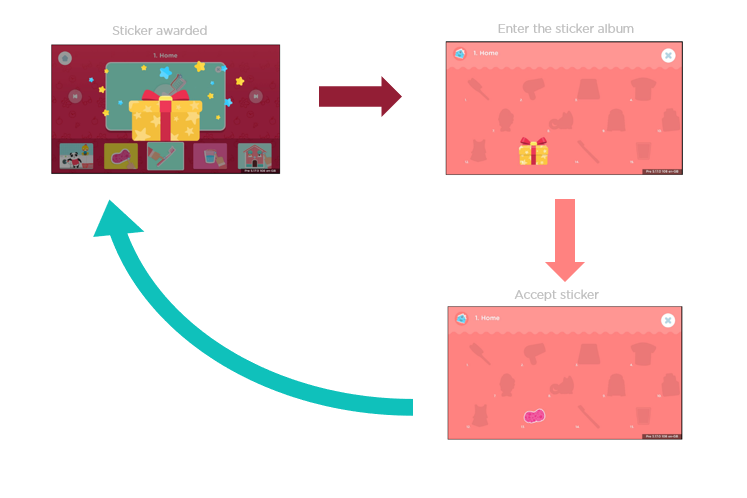
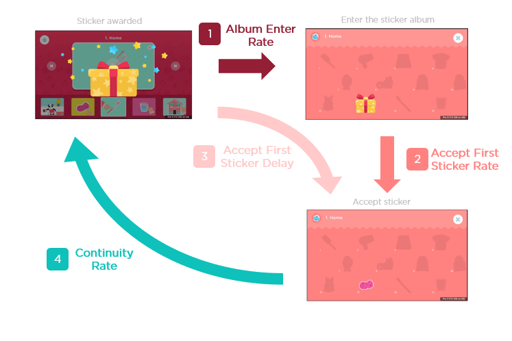
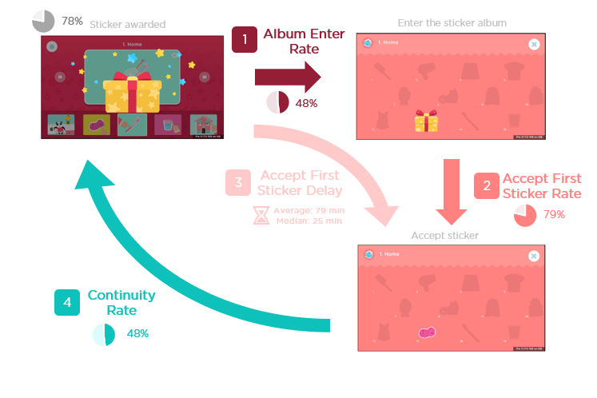

```{r setup, include=FALSE}
knitr::opts_chunk$set(echo = FALSE)
knitr::opts_chunk$set(warning = FALSE)
knitr::opts_chunk$set(message = FALSE)
options(knitr.kable.NA = '')
library(tidyverse)
library(jsonlite)
library(readr)
library(stringr)
library(bupaR)
library(anytime)
library(lubridate)
library(highcharter)
library(ggplot2)
library(formattable)
library(DT)
library(knitr)
library(kableExtra)
library(pwr)
library(fs)
library(janitor)
library(report)
source("src/functions.R")

  
```


```{r message=FALSE, warning=FALSE, include=FALSE, cache=TRUE}
# Raw data provided

users_df <- read_csv("../tables/users.csv")
customers_df <-  read_csv("../tables/customers.csv")
raw_events_df <-  read_csv("../tables/raw_events.csv")

raw_events_original_df <- read_csv("../raw_data/events-554c5b3e561b5eb4.csv.gz")

# Calculated tables
sessions_df <- read_csv("../tables/sessions.csv") 
session_event_df <- read_csv("../tables/session_event.csv")
child_sticker_awarded_df <- read_csv("../tables/child_sticker_awarded.csv")
child_sticker_accepted_df <- read_csv("../tables/child_sticker_accepted.csv")

```

## Understanding Sticker Feature

The aim of this practice test is to analyze in more depth the sticker feature in order to spot some potential problems and provide some recommendations regarding user experience.

### Part 1: Data cleaning

In this part we are presenting some considerations about data processing and tables used for this analysis.

Although it is a brief summary, more detail and whole code can be found at [GitHub](https://github.com/samuelhuerga/lingokids).

##### Data Provided

Three tables were provided with the exercise: `users`, `customers` and `events`. 


```{r message=FALSE, warning=FALSE, include=FALSE}
total_events <- raw_events_original_df %>% nrow()

events_considered <- raw_events_original_df %>% 
  mutate(app_version = ifelse(app_version == "5.9.0","5.09.0",app_version)) %>% 
  filter(app_version >= "5.09.0",game == "lk") %>% 
  nrow()

```

We have considered that stickers feature is only available from `version >= 5.9.0` and  `game == "lk"`, and as `r round(events_considered*100/total_events,1)`% of events fulfill this consideration, events whose version is lower than specified or game is distinct than `lk` were filtered out of the original dataset.


##### Transformed tables

Based on the original tables provided, other tables were created and extracted out from events table, in order to simplify the analysis. 

#### Sessions

As we have multiple events for the same child in different days across several weeks, it is needed to create a session identificator to be able to isolate behavior and measure how much time a child spends on the app. 

In order to separate sessions within a collection of child events, it has been considered that session starts:

* Either with one event of name `session_start` or `signup_successful`
* Or it has been more than one hour from previous event

We have created two tables: `session_event_df`, that links session_id and event_id, in order to identify which events belong to which session, and `sessions_df`, that summarise basic info about sessions, for example, which user and child are related or duration of session. 

#### Activities

Information about activities were unnested from json column `data` from `events` table provided from event_name `activity_enter` and `activity_exit`.

#### Sticker Album Enter

The same way than in activities, information about when a child enters the Sticker Album has been isolated into another table, `stickeralbum_enter_df`.

#### Sticker Awarded and Accepted

`child_sticker_awarded_df` and `child_sticker_accepted_df` contains information about which stickers have been awarded to a child, and if it has been accepted.


### Part 2: Hypotheses about sticker interaction

##### How may children interact with stickers?

First, let's review the process of stickers being awarded and accepted:

The expected behavior of a children when a sticker is awarded is that they:

1. Enter the album.
2. Accept the sticker awarded.
3. Ideally, this would lead the child to do more activities in order to gain more stickers

An overview of this funnel can be represented as follows:

  


##### Quantitative estimation of goodness of user experience
To estimate quantitatively how good is user experience, we can measure each step of the funnel:

1. How many children have entered the album after receiving their first sticker? **Album Enter Rate**
2. How many children enter the album but does not accept any sticker? **Accept First Sticker Rate**
3. How much time does it take to a child to accept his first sticker? **Accept First Sticker Delay**
4. After interacting with stickers, what ratio of children continues entering the album and accepting stickers? **Continuity Rate**

  
 
#### 1. Album Enter Rate
Due to the fact that once a sticker is awarded one needs to enter the album in order to accept it, let's see first how many children enters the album after receiving their first sticker.

```{r message=FALSE, warning=FALSE, include=FALSE}

# Funnel

total_children <- session_event_df %>% 
  distinct(child_id)

children_awarded <- total_children %>% 
  semi_join(child_sticker_awarded_df)

children_not_awarded <- total_children %>% 
  anti_join(child_sticker_awarded_df)
```

We have left out from the analysis children who have not received any sticker. They may have potentially used the app, but not received any sticker. They represent `r ((children_not_awarded %>% nrow)*100/(total_children %>% nrow)) %>% round(0)`% of children.

```{r echo=FALSE, message=FALSE, warning=FALSE}
child_album_entered_df <- child_sticker_awarded_df %>% 
  group_by(child_id) %>% 
  summarise(stickers_awarded = n()) %>% 
  left_join(raw_events_df %>% 
              filter(event_name == "stickeralbum_enter") %>% 
              group_by(child_id) %>% 
              summarise(album_enter = n())) %>% 
  mutate(album_enter = album_enter %>% coalesce(0L),
         entered = ifelse(album_enter > 0,"Entered the album", "Did not enter the album")) 

# Funnel
children_entered <- child_album_entered_df %>% 
  filter(entered == "Entered the album") %>% 
  select(child_id)
```

`r ((children_entered %>% nrow)*100/(children_awarded %>% nrow)) %>% round(0)`% of children have entered the album after a sticker has been awarded.

```{r echo=FALSE, message=FALSE, warning=FALSE}
child_album_entered_df %>% 
  tabyl(entered) %>% 
  rename(Children = n,
         ` ` =entered) %>% 
  dt_lingokids
```

And we can see how distribution of number of stickers awarded, that could be a proxy for numbers of activities completed, vary from children who have entered the album to children who have not:

```{r echo=FALSE, message=FALSE, warning=FALSE}
child_album_entered_df %>% 
  ggplot(aes(x = stickers_awarded, fill = entered)) +
  geom_histogram(show.legend = F) +
  facet_grid( entered~.) +
  theme_lingokids() +
  scale_fill_manual(values = c("#FF9ABF","#0EDDD3"))

```


#### 2. Accept First Sticker Rate

Next step in funnel is quantify how many children have entered the album and indeed have accepted the first (or more) stickers awarded:

```{r echo=FALSE, message=FALSE, warning=FALSE, paged.print=TRUE}
child_accept_first_sticker_df <- child_album_entered_df %>% 
  left_join(session_event_df %>% 
              filter(event_name == "child_sticker_accepted") %>% 
              group_by(child_id) %>% 
              summarise(timestamp_first_accepted = min(timestamp)) %>% mutate(accepted = T)) %>% 
  mutate(accepted = accepted %>% coalesce(FALSE)) %>% 
  mutate(accepted = ifelse(accepted,"Accepted first sticker", "Did not accept first sticker"))

# Funnel
children_accepted <- child_accept_first_sticker_df %>% 
  filter(accepted == "Accepted first sticker") %>% 
  select(child_id)

child_accept_first_sticker_df %>% 
  filter(entered == "Entered the album") %>% 
  tabyl(accepted) %>% 
  rename(Children = n,
         ` ` = accepted) %>% 
  dt_lingokids


```


This means that `r (100 - (children_accepted %>% nrow)*100/(children_entered %>% nrow)) %>% round(0)`% of children enters the album but does not accept stickers.


#### 3. Accept First Sticker Delay
Let`s measure how much time does it take to a child to accept his first sticker.

In order to measure total time, only data within sessions have been considered, that is, if a child does not accept a sticker in the same session that has been awarded, gap time between sessions does not count to the first accept sticker delay

```{r echo=FALSE, message=FALSE, warning=FALSE}
time_until_accepted_df <- sessions_df %>% 
  left_join(
  session_event_df %>% 
    filter(event_name == "child_sticker_awarded") %>% 
    group_by(child_id) %>% 
    filter(timestamp == min(timestamp)) %>% 
    select(session_id,child_id,timestamp_awarded = timestamp)
) %>% 
  left_join(
    session_event_df %>% 
      filter(event_name == "child_sticker_accepted") %>% 
      group_by(child_id) %>% 
      filter(timestamp == min(timestamp)) %>% 
      select(session_id,child_id,timestamp_accepted = timestamp)
  ) %>% 
  arrange(child_id,timestamp_ini) %>% 
  group_by(child_id) %>% 
  mutate(awarded = !is.na(timestamp_awarded) ,
         accepted = !is.na(timestamp_accepted)) %>% 
  mutate(awarded = cumsum(awarded),
         accepted = cumsum(accepted) %>% lag(default = FALSE),
         session = awarded -accepted) %>% 
  filter(session == 1) %>% 
  mutate(duration = ifelse(!is.na(timestamp_awarded) & !is.na(timestamp_accepted),difftime(timestamp_accepted, timestamp_awarded,units = "mins"),
                           ifelse(!is.na(timestamp_awarded), difftime(timestamp_fin, timestamp_awarded,units="mins"),
                                  ifelse(!is.na(timestamp_accepted), difftime(timestamp_accepted, timestamp_ini,units="mins"),
                                         session_duration)))
                           ) %>% # filter(child_id == 5707841)
  summarise(time_until_accepted = sum(duration))

time_until_accepted_df %>% 
  semi_join(child_sticker_accepted_df) %>% 
  ggplot(aes(x= time_until_accepted)) +
  geom_density(color = "#0EDDD3")+
  # facet_grid(entered~.)+
  theme_lingokids() +
  xlim(c(0,500))
  
stats_time_until_accepted <- time_until_accepted_df %>% 
  semi_join(child_sticker_accepted_df) %>% 
  summarise(mean = mean(time_until_accepted),
            median = median(time_until_accepted),
            q80 = quantile(time_until_accepted,0.8))

mean_time_util_accepted <- stats_time_until_accepted %>% pull(mean)
median_time_util_accepted <- stats_time_until_accepted %>% pull(median)
q80_time_util_accepted <- stats_time_until_accepted %>% pull(q80)

```

Average time until a sticker is accepted is `r round(mean_time_util_accepted)` minutes, and 50% of children who have accepted, have done it before `r round(median_time_util_accepted)` minutes.

#### 4. Continuity Rate

How many children continues using sticker feature (that is, continue awarding and accepting stickers)?


```{r echo=FALSE, message=FALSE, warning=FALSE}

children_continue <- session_event_df %>% 
  filter(event_name %>% str_detect("child_sticker_")) %>% 
  inner_join(
    session_event_df %>% 
      filter(event_name == "child_sticker_accepted") %>% 
      group_by(child_id) %>% 
      summarise(timestamp_first_accepted = min(timestamp))
  ) %>% 
  filter(timestamp >= timestamp_first_accepted) %>% 
  group_by(child_id,event_name) %>% 
  summarise(n = n()) %>% 
  mutate(event_name = event_name %>% str_replace("child_","")) %>% 
  spread(event_name,n,0) %>% 
  # mutate(continue_awarding = sticker_awarded >= 4,
  #        continue_accepting = sticker_accepted >= 4) %>% 
  mutate(continuity = sticker_awarded >= 4 & sticker_accepted >= 5) %>% # 5 stickers for accepted as we are counting the first accept sticker.
  mutate(continuity = ifelse(continuity, "Continues using Stickers", "Do not continue using stickers")) %>% 
  ungroup


```


We have stablished the threshold of 4 more stickers awarded and accepted, because it represents awarding stickers form two different topics, as only 2 stickers are awarded per topic, so this could filter out some continuity versus children who drop out.


```{r echo=FALSE, message=FALSE, warning=FALSE}
children_continue%>% 
  # tabyl(continue_awarding,continue_accepting) %>% 
  tabyl(continuity) %>%
  rename(Children = n,
         ` ` = continuity) %>% 
  dt_lingokids()

```

#### Whole picture

We can see the complete then the funnel presented:

  


And we can represent with a diagram, to see how many children continues using stickers feature:

```{r echo=FALSE}
# Inspired of https://beta.rstudioconnect.com/content/5294/funnel_plot.nb.html

child_classification <- total_children %>% 
  left_join(children_awarded %>% mutate(awarded = "Awarded first sticker")) %>% 
  left_join(children_entered %>% mutate(entered = "Entered the album")) %>% 
  left_join(children_accepted %>% mutate(accepted = "Accepted first sticker")) %>% 
  left_join(children_continue %>% select(child_id,continuity)) 

stages <- child_classification %>% 
  mutate(entered = na_if(entered,"Did not enter the album"),
         accepted = na_if(accepted, "Did not accept first sticker"),
         continuity = na_if(continuity, "Do not continue using stickers")) %>% 
  summarise_all(~mean(!is.na(.))) %>% 
  gather(stage, percent) %>% 
  mutate(stage = c("Total children","Awarded first sticker","Entered the album","Accepted first sticker","Continues using stickers")) %>% 
  mutate(stage = fct_inorder(stage))

to_poly <- stages %>%
  arrange(percent) %>%
  mutate(
    group = row_number(),
    x1 = 0 + ((1 - percent)/2),
    x4 = percent + ((1 - percent)/2),
    x2 = lag(x1), x3 = lag(x4)
  ) %>%
  mutate(
    x2 = ifelse(is.na(x2), x1, x2),
    x3 = ifelse(is.na(x3), x4, x3)
  ) %>%
  gather(xpoint, x, -stage,-group, -percent) %>%
  arrange(group, xpoint) %>%
  mutate(y = ifelse(xpoint %in% c("x2", "x3"), group, group + 1))


labels <- stages %>%
  arrange(percent) %>%
  mutate(y = row_number() + 0.5)

cbPalette <- c( "#F3BE3B","#A6A6A6", "#931E35", "#FF8280", "#0FC1BB")

to_poly %>%
  ggplot() +
  geom_polygon(aes(x, y, group = group, fill = stage)) +
  geom_text(aes(x = 0.5, y = y, label = paste0(round(percent * 100), "%")), data = labels, size = 4,family = "Gotham", color = "white") +
  scale_y_continuous(breaks = labels$y, labels = labels$stage) +
  theme_lingokids() +
  theme(
    legend.position = "none", 
    axis.title = element_blank(), 
    axis.text.x = element_blank(), 
    axis.ticks.x = element_blank(), 
    panel.grid.major.x = element_blank(),
    panel.grid.minor.x = element_blank(), 
    panel.grid.minor.y = element_blank()
  ) +
scale_fill_manual(values = cbPalette) 

```


To summarise, only `r stages %>% filter(stage == "Continues using stickers") %>% pull(percent) %>% round(2) %>% {.*100}`% of children continues interacting with stickers features.


##### What is the goal of stickers?

The ultimate goals of stickers are **engagement** and **retention**:

- Stickers are meant to engage children, by rewarding them when completing activities. It encourages them in the short term to continue completing other activities (to get more stickers). 
- As stickers are only awarded in the first two activities in the chapter, they are meant to rise the frequency children connects to the app in the mid-term, and thus, rise the frequency of sessions and activities completed.

##### How can we tell if stickers are fulfilling these goals?

In order to see if stickers features are improving engagement and retention, we can approximate these two aspects with some metrics:

* The average session duration
* The number of sessions

If duration of sessions rises, it would imply that children spend more time per session in the app, leading to more engagement, and number of sessions could approximate the frequency children uses the app.

Although we are going to analyze these two metrics, we can study other different ones, such as number of activities completed, number of chapters completed, weekly frequency of sessions...

Ideally, for retention we could study cancelling rate (percentage of customers who changes from active to cancelled). However, because of number of cancelled customers is so low, an approach focused on session distribution has been preferred.


```{r echo=FALSE, message=FALSE, warning=FALSE}

segmentation_df <- children_continue %>% 
  inner_join(customers_df %>% 
               inner_join(sessions_df %>% distinct(user_id,child_id)) %>% 
               select(child_id,status)) %>% 
  filter(sticker_awarded >=4) %>% 
  mutate(continuity = ifelse(sticker_accepted >= 5, "Continues accepting stickers","Does not continue accepting stickers, but continues awarding them"))


sessions <- sessions_df %>% 
  inner_join(segmentation_df %>% filter(status != "canceled")) %>% 
  # inner_join(child_classification) %>% 
  filter(!is.na(continuity)) %>% 
  group_by(continuity,user_id,child_id,platform, status) %>% 
  summarise(n_sessions = n(),
            mean_time = mean(session_duration),
            total_time = sum(session_duration)) %>% 
  ungroup

```

#### Considerations

In order not to introduce bias in data, we have been more restrictive, and we are comparing children who continues accepting stickers (last step of funnel) with children who continues awarding stickers, but don't accept them. Please note this is a part of collective `Do not continue using stickers`

```{r echo=FALSE, message=FALSE, warning=FALSE}
segmentation_df %>% tabyl(continuity) %>% 
  rename(Children = n,
         ` ` = continuity) %>% 
  dt_lingokids()

```

Besides, these analyses are made by payment status, in order to isolate trial and active users. Users with status `canceled` are filtered out.

#### Average duration of sessions

```{r echo=FALSE, message=FALSE, warning=FALSE}
sessions %>% 
  mutate(continuity = str_wrap(continuity,width = 40)) %>% 
  ggplot(aes(x = mean_time,color = continuity, fill = continuity))+
  geom_density(alpha = 0.2)+
  ggtitle("Distribution of average duration of sessions") +
  facet_grid(status ~.) +
  theme_lingokids()+
  scale_fill_manual(values = c("#0EDDD3","#FF9ABF")) +
  scale_color_manual(values = c("#0EDDD3","#FF9ABF")) 


```


We run the following hypothesis testing, one for each status:

$$ H_0 :   \text{Average Time Session}_{\text{Continues}} = \text{Average Time Session}_{\text{Does not continue}} \\ 
   H_A :   \text{Average Time Session}_{\text{Continues}} > \text{Average Time Session}_{\text{Does not continue}}  $$

  
```{r echo=FALSE, message=FALSE, warning=FALSE}
hypothesis_tests <-  sessions %>% 
  ungroup %>% 
  nest(-status) %>% 
  mutate(ttest = map(data, ~t.test(mean_time ~ continuity,.x,alternative = "greater"))) %>% 
  mutate(p_value = map_dbl(ttest, "p.value"))

hypothesis_tests %>%
  arrange(status) %>% 
  select(-data, -ttest) %>% 
  dt_lingokids()

test_unpaid <- hypothesis_tests %>% filter(status == "unpaid")
test_active <- hypothesis_tests %>% filter(status == "active")
test_trial <- hypothesis_tests %>% filter(status == "trial")
```

So, we can say that for active and unpaid users, there is a statistically significative difference in average time session. However, for trial users, we cannot state the difference between means is statistically significant.

#### Number of sessions

```{r echo=FALSE, message=FALSE, warning=FALSE}
sessions %>% 
  mutate(continuity = str_wrap(continuity,width = 40)) %>% 
  ggplot(aes(x = n_sessions,color = continuity, fill = continuity))+
  geom_density(alpha = 0.2)+
  ggtitle("Distribution of number of session") +
  facet_grid(status ~.) +
  theme_lingokids()+
  scale_fill_manual(values = c("#0EDDD3","#FF9ABF")) +
  scale_color_manual(values = c("#0EDDD3","#FF9ABF")) 


```

We run the following hypothesis testing, one for each status:

$$ H_0 :   \text{Number of sessions}_{\text{Continues}} = \text{Number of sessions}_{\text{Does not continue}} \\ 
   H_A :   \text{Number of sessions}_{\text{Continues}} > \text{Number of sessions}_{\text{Does not continue}}  $$

  
```{r echo=FALSE, message=FALSE, warning=FALSE}
hypothesis_tests <-  sessions %>% 
  ungroup %>% 
  nest(-status) %>% 
  mutate(ttest = map(data, ~t.test(n_sessions ~ continuity,.x,alternative = "greater"))) %>% 
  mutate(p_value = map_dbl(ttest, "p.value"))

hypothesis_tests %>%
  arrange(status) %>% 
  select(-data, -ttest) %>% 
  dt_lingokids()

test_unpaid <- hypothesis_tests %>% filter(status == "unpaid")
test_active <- hypothesis_tests %>% filter(status == "active")
test_trial <- hypothesis_tests %>% filter(status == "trial")
```

So we can state that there is a statistically significative difference in number of sessions.


### Part 3: Recommendations

First of all, let's summarise all analysis provided in previous part:

User experience of stickers feature is not good in general, because of: 

* The fact that children need to enter the album in order to accept the sticker awarded make that one out of two children do not even enter the album, perhaps due to they did not understand how it works or they do not find it interesting.<br /><br />
RECOMMENDATIONS:

    + Give the option to accept the sticker at the same moment they are awarded without having to enter the sticker album.
    + Once they have been awarded their sticker, kindly guide children to album to make them learn where they are located.
    + Notificate with a reminder that they have stickers that have not been accepted.


* Children who have interacted with stickers don't continue using it. in other words, continuity rate is low. This could be because children may not find sticker album feature as interesting as expected.<br /><br />
RECOMMENDATIONS:

    + Make the album more attractive. If album would have some other features such as word related to the sticker (in order to spend more time in album section), such as linking the sticker with the activity where it was awarded, or showing and playing the word when clicking on them, it should engage children to interact with stickers rather than only collecting them.

However, it is worth working in this feature, because we have seen in previous analysis that children who continuous accepting stickers spend more time in the app, on average. 


##### Other recommendations

When designing a feature like this, we have some options before launching them publicly to all users:

* Experiment first with only a sample of people, and A/B test for significant differences on behavioral KPIs we want to improve. This could help us debug conceptual errors before the feature was available for every user.

* Test concepts with qualitative analysis, such as focus groups. Some of the behavior we understand as natural can be biased by the way we have learned things, but a child may have not learnt it yet and find he feature unintuitive. We can discover some patterns and ideas we have not thought of when designing the feature.

##### Improving the analysis

This analysis could be enriched if more data were collected, for example, the age of children, or the device type (mobile, tablet) could improve the results.

Besides, if we could have more temporal data, we could have experiment in more depth by comparing the effect of before and after releasing the feature, with an A/B test.
